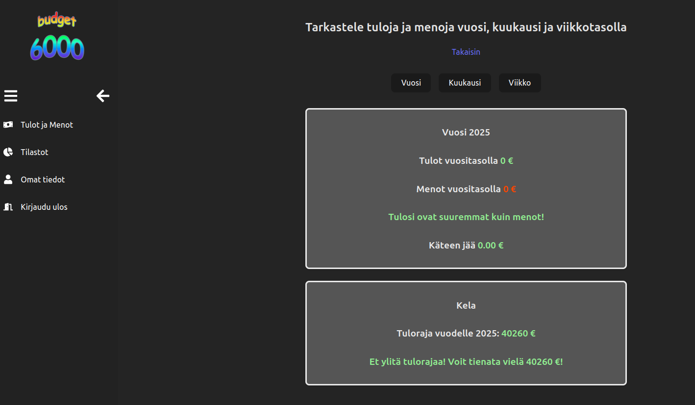

# Budget6000

Simple budgeting app designed for finnish students. 
Users can add their income and expenses to see if they qualify for student allowances. 

## Built with

**Frontend** React
**Backend** .NET (C#) and MongoDB Cloud
**Hosting** Hostinger

##

##

Hosted at: budget.tonitu.dev